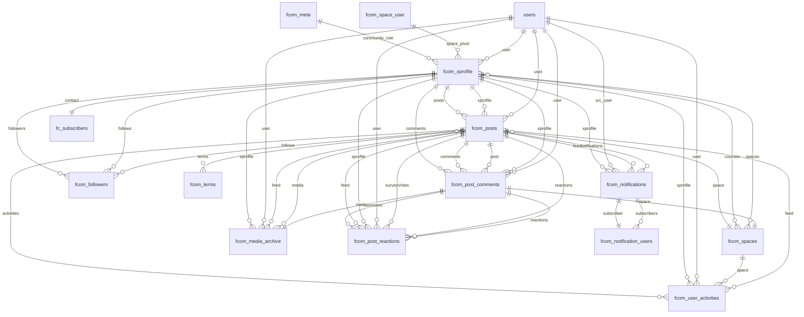
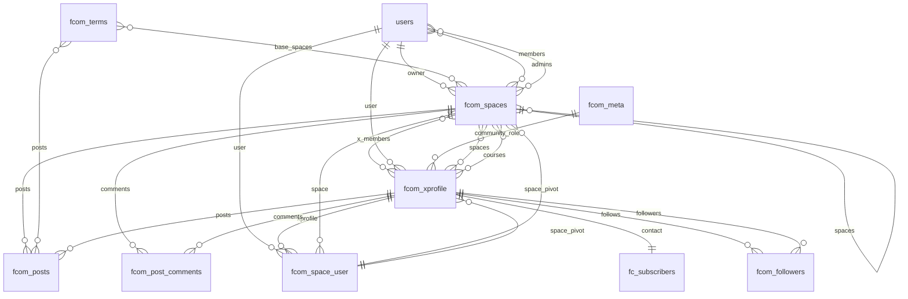
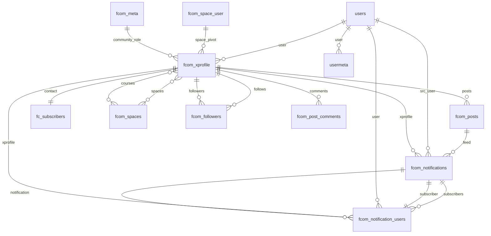

# Database Schema

FluentCommunity defines 13 first-party database tables in `database/Migrations/`, plus relationships to WordPress core tables and optional integration tables.

## Table Inventory

| Table | Source |
| --- | --- |
| `fcom_user_activities` | database/Migrations/UserActivitiesMigrator.php |
| `fcom_spaces` | database/Migrations/FeedSpaceMigrator.php |
| `fcom_post_comments` | database/Migrations/FeedCommentsMigrator.php |
| `fc_subscribers` | FluentCRM table. It is referenced by FluentCommunity when FluentCRM is installed. |
| `fcom_posts` | database/Migrations/FeedMigrator.php |
| `fcom_media_archive` | database/Migrations/MediaArchiveMigrator.php |
| `fcom_meta` | database/Migrations/MetaMigrator.php |
| `fcom_notifications` | database/Migrations/NotificationsMigrator.php |
| `fcom_notification_users` | database/Migrations/NotificationUserMigrator.php |
| `fcom_post_reactions` | database/Migrations/FeedReactionsMigrator.php |
| `fcom_space_user` | database/Migrations/FeedSpaceUserMigrator.php |
| `fcom_terms` | database/Migrations/TermMigrator.php |
| `users` | WordPress core table. FluentCommunity reads from it but does not create or migrate it. |
| `usermeta` | WordPress core table. FluentCommunity exposes it through `UserMeta`, but schema ownership stays with WordPress. |
| `fcom_xprofile` | database/Migrations/XProfileMigrator.php |
| `fcom_followers` | Inherited / external table |
| `fn_subscriptions` | Inherited / external table |

## Content Relationships

## Space, Membership, and Taxonomy Relationships

## Notifications, Meta, and Profile Relationships

